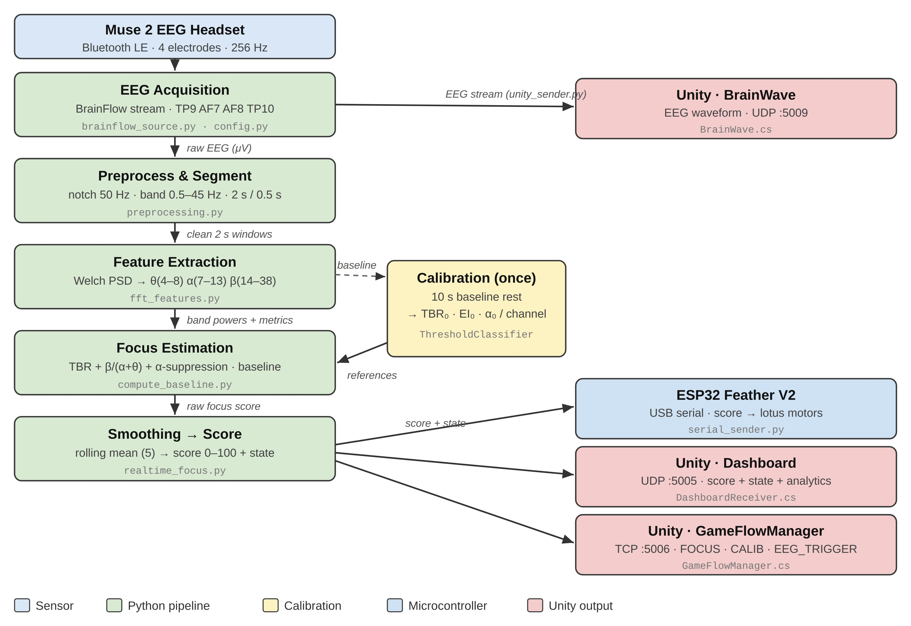

# Flow State

**Visualizing attention through EEG-driven physical and digital interaction.**

Flow State is an interactive focus training installation. A [Muse 2](https://choosemuse.com/products/muse-2?_pos=1&_sid=180e99c96&_ss=r) EEG headband measures a participant's attention while they complete a short, distraction rich reading task. The resulting focus score drives two things at once: a motorised **lotus** that physically blooms as focus is sustained, and a **Unity dashboard** that shows a live brainwave display, focus timeline, and leaderboard.

> The full implementation — Python processing pipeline, ESP32 firmware, and Unity application — is open source in this repository.

University of Melbourne · Agung Asril · Amjad Almuwallad · Brodie Kershaw · Revathi Raghavan

---

## How it works



The Muse 2 streams EEG to a Python pipeline via BrainFlow. Each 2 second window is filtered, turned into frequency domain features, and combined into a single 0–100 focus score. That one score is sent to both the ESP32 (which moves the lotus and LED matrix) and Unity (which renders the dashboard), keeping the physical and digital feedback in sync.

```
Muse 2 ──► realtime_focus.py ──► preprocessing ──► fft_features ──► ThresholdClassifier ──► score
                                                                                  │
                                                          ┌───────────────────────┴───────────────────────┐
                                                          ▼                                                 ▼
                                                  serial_sender.py                                  unity_sender.py
                                                          ▼                                                 ▼
                                                ESP32 (lotus + LEDs)                          Unity (dashboard, leaderboard,
                                                                                                  brainwave display)
```


## Repository structure

```
Flow-State/
├── README.md
├── LICENSE
├── .gitignore
├── requirements.txt
├── python/                       # real-time EEG pipeline
│   ├── realtime_focus.py         #   entry point (session loop + Unity listener)
│   ├── config.py                 #   all pipeline settings
│   ├── preprocessing.py          #   notch + bandpass filtering, windowing, artifact rejection
│   ├── fft_features.py           #   Welch PSD → band powers + focus metrics
│   ├── compute_baseline.py       #   ThresholdClassifier (calibration + scoring)
│   ├── serial_sender.py          #   USB serial link to the ESP32
│   └── unity_sender.py           #   UDP/TCP link to Unity
├── firmware/
│   └── esp32_servo_focus/
│       └── esp32_servo_focus.ino #   motor + LED matrix + button control
├── unity/Scripts/                # drop into your Unity project's Assets/Scripts
│   ├── GameFlowManager.cs        #   session flow, leaderboard, launches Python
│   ├── DashboardReceiver.cs      #   post-session analytics dashboard
│   └── BrainWave.cs              #   live EEG waveform + focus display
└── docs/
    └── architecture.png          #   the diagram above
```

---

## Network ports

Python and Unity talk over local sockets. These must match on both sides.

| Port | Type | Direction | From → To |
|------|------|-----------|-----------|
| 5005 | UDP  | Python → Unity | `unity_sender.py` → `DashboardReceiver.cs` (score, state, analytics) |
| 5006 | TCP  | Python → Unity | `unity_sender.py` → `GameFlowManager.cs` (FOCUS / CALIB / EEG_TRIGGER) |
| 5007 | UDP  | Unity → Python | `GameFlowManager.cs` → `UnityCommandListener` (START_CALIBRATION / START_SESSION / motor commands) |
| 5009 | UDP  | Python → Unity | `unity_sender.py` → `BrainWave.cs` (live EEG waveform) |

---

## Software setup (Python)

Requires Python 3.10+.

```bash
cd python
python -m venv .venv
source .venv/bin/activate        # Windows: .venv\Scripts\activate
pip install -r ../requirements.txt
```

### Running


```bash
python realtime_focus.py
```

**With Unity** — `GameFlowManager.cs` launches this automatically with the `--unity` flag, so it listens for Unity commands. To run it by hand:

```bash
python realtime_focus.py --unity
```

Before running: turn on the Muse 2 (do **not** pair it through macOS Bluetooth — BrainFlow connects directly), flash the ESP32, and close the Arduino Serial Monitor so the port is free.

---

## Firmware setup (ESP32)

- **Board:** Adafruit ESP32 Feather V2 (install ESP32 board support in the Arduino IDE)
- **Library:** `LEDMatrixDriver` (install via Library Manager)
- The full pin map (motors, encoders, buttons, MAX7219 matrix) is documented in the header comment of `firmware/esp32_servo_focus/esp32_servo_focus.ino`.

Open the `.ino`, select the Feather V2 board and its serial port, and upload.

**Score → motor behaviour:** 0–33 distracted → motors stop · 34–66 neutral → slow · 67–100 focused → bloom burst. Four base buttons fire manual bursts for setup and reset.

---

## Unity setup

The three C# scripts in `unity/Scripts/` go into your Unity project's `Assets/Scripts` folder. `GameFlowManager` drives the whole session flow (onboarding → calibration → reading activity → dashboard) and launches the Python pipeline as a subprocess. Set its `pythonPath` and `pythonScriptPath` fields in the Inspector to point at your Python executable and `realtime_focus.py`.

---

## License

Released under the [MIT License](LICENSE).
